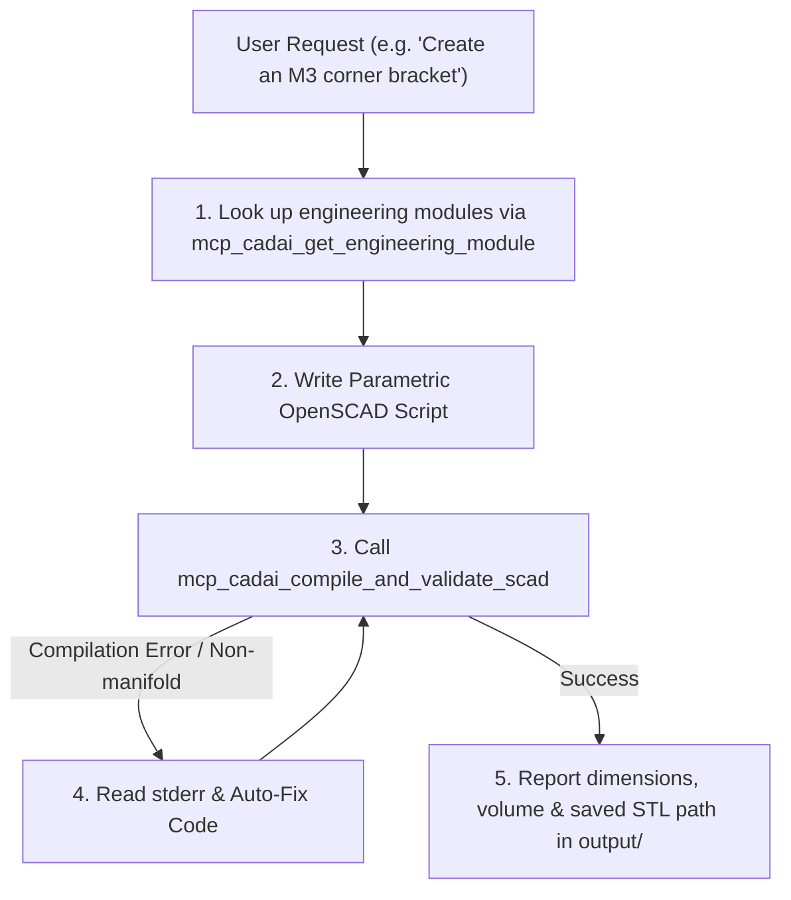

# CAD Engineering & Mechanical Design Skill

This skill equips Antigravity to act as an expert Mechanical Design Engineer and Parametric CAD Copilot.

## Core Capabilities
- **Parametric OpenSCAD Modeling**: Writes deterministic, watertight solid geometry for functional parts.
- **WASM STL Compilation**: Compiles and validates geometry in real-time via the `mcp_cadai_compile_and_validate_scad` tool.
- **Hardware Standards**: Built-in tables for M2, M3, M4, M5, M6 screw clearance holes, counterbores, hex nut traps, and heat-set brass inserts.
- **Mechanical Joinery & Lattices**: Tapered cantilever snap-fits ($\epsilon \le 1.5\%$), PCB standoffs, sliding dovetails, print-in-place revolving hinges, and honeycomb lightweighting grids.

---

## Workflow for Designing Mechanical Parts

When the user asks to design, modify, or verify a 3D model:

### Step 1: Query Engineering Modules
If designing fasteners, snap-fits, enclosures, or lattices, call:
`mcp_cadai_get_engineering_module({ moduleKey: 'fastener_hardware' | 'cantilever_snap_fit' | 'enclosure_features' | 'structural_ribs_gussets' | 'sliding_dovetail_joint' | 'print_in_place_hinge' | 'honeycomb_lattice' | 'polar_bolt_circle' | 'involute_spur_gear' })`

### Step 2: Write Clean Parametric OpenSCAD
- Always declare parameters at the top.
- Maintain minimum wall thickness $\ge 1.6\text{mm}$.
- Apply the **Overlap Rule** ($+0.02\text{mm}$) on all `difference()` cuts.
- Never use 3D `minkowski()`.

### Step 3: Compile and Validate
Call:
`mcp_cadai_compile_and_validate_scad({ code: openScadCode, outputName: "part_name" })`

This automatically saves the `.scad` and `.stl` files into the `./output/` directory and returns exact volume, triangle count, and bounding box dimensions.
